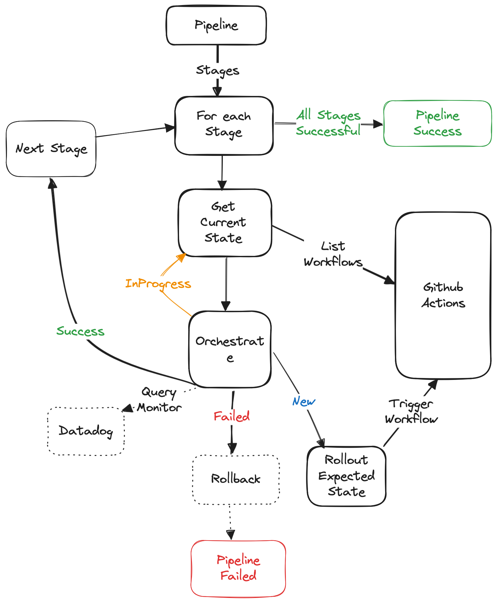

<p align="center">
  
  <h3 align="center">pippy</h3>
  <p align="center">Create dynamic pipelines on github actions</p>
</p>

---

## Introduction

Welcome to pippy, thank you visiting this project. Pippy allows you to create configurable pipelines on Github Actions(a.k.a workflows). Examples,

1. `CI(Tests)` **->** `Build docker image` **->** `Deploy docker image (Staging)` **->** `Approval` **->** `Deploy docker image(Production)`
1. `Terraform plan` **->** `Approval` **->** `Terraform apply`
1. `Deploy Staging` **->** `E2E Tests(Datadog monitored)` **->** `Approval` **->** `Deploy Production`

## Features

1. Automatic rollback on workflow or datadog failures.
1. Halt pipeline on workflow failures.
1. Datadog Monitoring upto pre configured time (default: 15mins after workflow execution completes).
1. Stage approval.
1. Lock pipelines to avoid any approvals.
1. Audits for critical actions.
1. Ability to create pipelines dynamically without learning YAML

## Installation

* Download latest release for you platform from releases

## Quick Start

* Perform github login (all data is stored locally)

```bash
pippy user login
```

* Workflows used as part of pipeline needs to be pippy ready. Use spacebar to select repo

```bash
pippy workflow validate
```

* After corresponding changes are made to workflows and merged to repo, verify by running above validations

* Create a new pipeline by following steps

```bash
pippy pipeline create --name my-first-pipeline
```


* Execute your first pipeline run by providing pipeline inputs

```bash
pippy pipeline run execute --name my-first-pipeline -input version=e3d0bea
```

* List recent pipeline runs

```bash
pippy pipeline run list --name my-first-pipeline
```

## How it works



## Faq

### Do you have cloud/hosted solution?

Cloud version is coming soon, please signup here at [pippy](https://pippy.dev), this has some additional features

* Github triggers
* Collaboration for teams

### What are the alternatives?

If you do not require any features mentioned above, you can easily chain your workflows in github [reusing workflows](https://docs.github.com/en/actions/using-workflows/reusing-workflows), be aware of the [limitations](https://docs.github.com/en/actions/using-workflows/reusing-workflows#limitations).

### Where is the data stored?

All data is stored locally in `HOMEDIR/.pippy`
